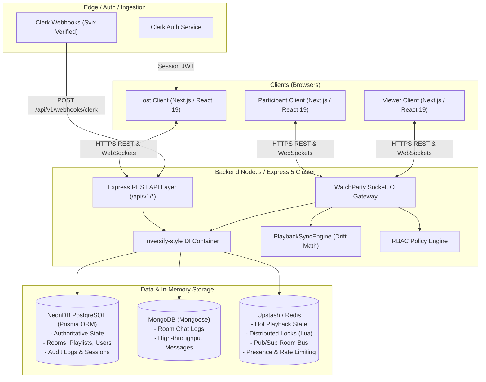
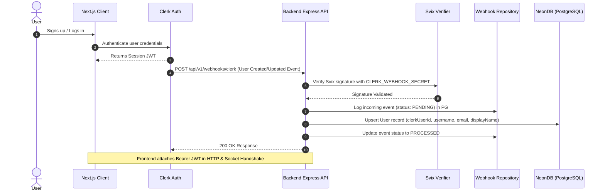
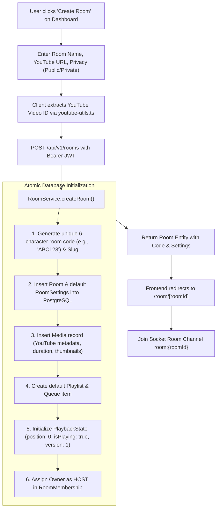
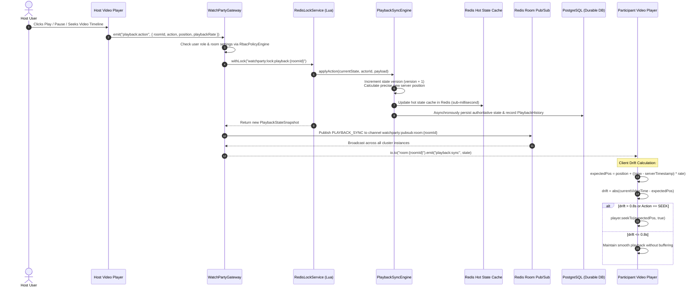
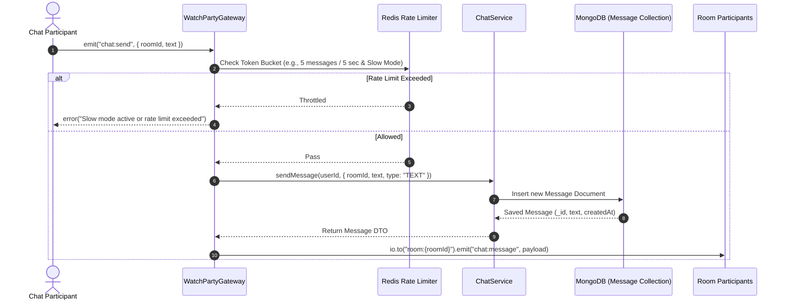
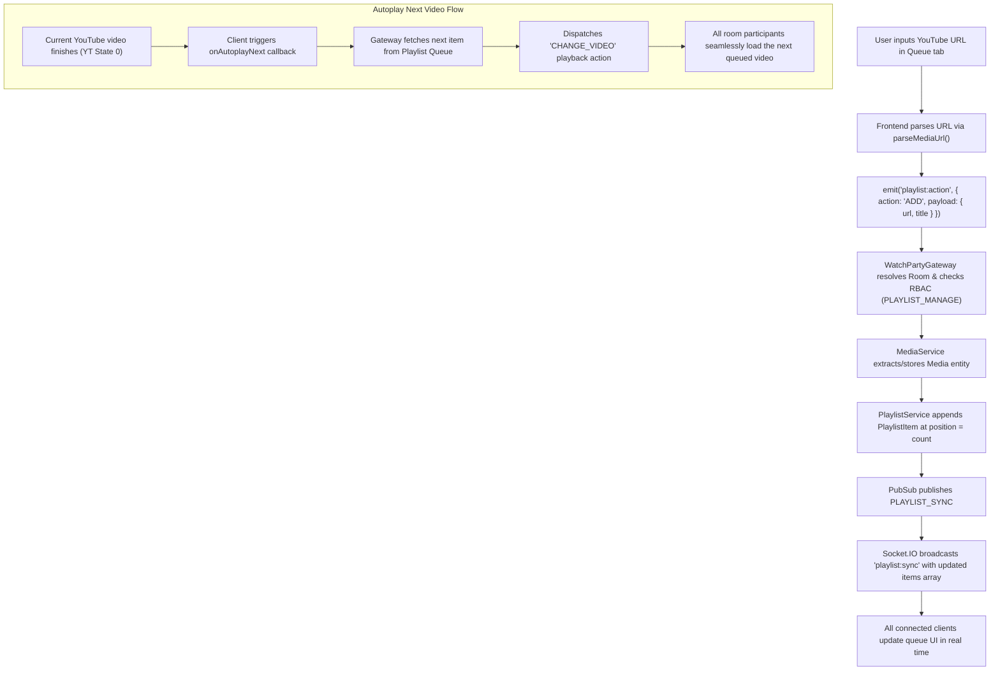
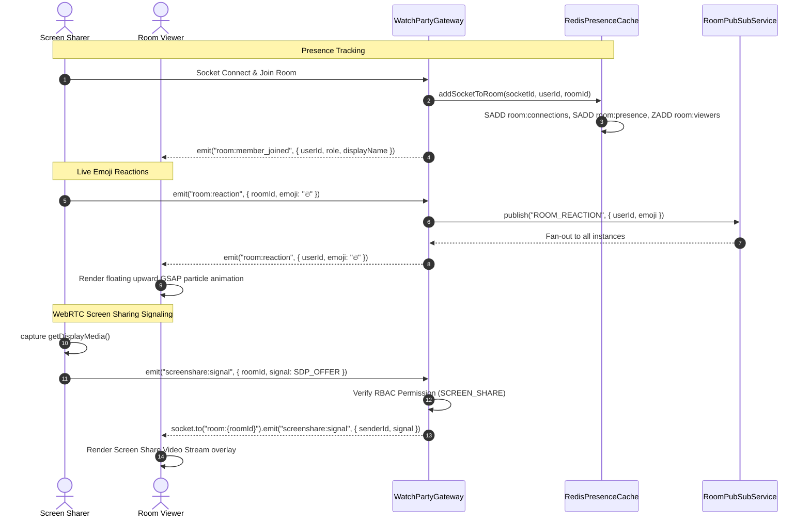

# YouTube Watch Party — System Architecture & Technical Specifications

This document provides a comprehensive technical overview of the **YouTube Watch Party** system, covering the polyglot multi-database architecture, modular backend engine, real-time WebSocket protocol, synchronization algorithms, and reactive frontend layer.

---

## 1. System Architecture & High-Level Topology

The application uses a **hybrid polyglot database architecture** paired with a **Modular MVC / Clean Architecture** backend and a **Next.js 16 App Router** frontend:



---

## 2. Multi-Database Storage Strategy

The platform segregates storage workloads across 3 dedicated databases based on access frequency, consistency requirements, and latency profiles:

| Data Store | Technology | Primary Responsibilities | Key Entities / Keys |
| :--- | :--- | :--- | :--- |
| **Relational DB** | **Neon PostgreSQL** via `contract.prisma` | Authoritative business entities, relational constraints, strict ACID compliance, audit history | `User`, `UserDevice`, `Room`, `RoomSettings`, `RoomMembership`, `Media`, `Playlist`, `PlaylistItem`, `PlaybackState`, `PlaybackHistory`, `WatchSession`, `RoomEvent`, `WebhookEvent` |
| **Document DB** | **MongoDB** via `message.model.ts` | High-volume real-time chat messages, sub-document replies, mentions | `Message` collection (indexed on `{ roomId: 1, createdAt: -1 }` for cursor pagination) |
| **In-Memory Cache** | **Redis / Upstash** via `redis.ts` | Sub-millisecond state access, distributed concurrency locking, token bucket rate limits, multi-node message fan-out | Hot Playback Cache (`watchparty:playback:{roomId}`), Distributed Mutex Lock (`watchparty:lock:playback:{roomId}`), Presence Sets, Socket-to-User maps, Room Pub/Sub (`watchparty:pubsub:room:{roomId}`) |

---

## 3. Backend Core Design & Dependency Injection

The backend leverages custom Dependency Injection (`container.ts`) and Token Identifiers (`identifiers.ts`) registered in `register-dependencies.ts`.

### Backend Modules Breakdown

```
backend/src/
├── app.ts                         # Express application setup, security headers, CORS, routers
├── index.ts                       # Server bootstrap, Socket.IO binding, DB warmup & graceful shutdown
├── config/
│   └── env.config.ts              # Zod environment schema & dynamic Redis URL derivation
├── core/
│   ├── di/                        # Inversion of Control (IoC) Container & Registration
│   ├── errors/                    # AppError hierarchy (BadRequest, Unauthorized, Forbidden, NotFound)
│   ├── events/                    # In-memory Domain Event Dispatcher
│   └── middlewares/               # Request logger, validation with Zod, global error boundary
├── infrastructure/
│   ├── cache/                     # Redis hot playback state & presence caches
│   ├── database/                  # Prisma PostgreSQL, Mongoose, and ioredis clients
│   └── redis/                     # Distributed Lock (Lua), Rate Limiter, Redis Pub/Sub Bus
├── modules/
│   ├── auth/                      # Clerk JWT verification middleware & ClerkClientAdapter
│   ├── chat/                      # Chat service, Mongoose repository, chat controller & routes
│   ├── media/                     # YouTube URL parser provider, media repository & service
│   ├── memberships/               # Room joining, member roles, kicks, bans, invitations
│   ├── playback/                  # Playback state persistence, history logging, PlaybackSyncEngine
│   ├── playlists/                 # Queue management, item ordering, multi-item playlist service
│   ├── rbac/                      # Dynamic Role-Based Access Control policy engine
│   ├── rooms/                     # Room lifecycle, settings configuration, code/slug resolution
│   ├── sessions/                  # Watch session tracking and analytics heartbeats
│   ├── users/                     # Profile retrieval, device tracking
│   └── webhooks/                  # Idempotent Clerk event processor (created, updated, deleted)
└── realtime/
    ├── gateways/                  # WatchPartyGateway handling all WebSocket room events
    ├── socket-server.ts           # Socket.IO instantiation, Redis adapter, handshake auth
    └── socket.types.ts            # Strongly typed client-to-server and server-to-client contracts
```

---

## 4. End-to-End Process Flows & Sequence Diagrams

---

### Flow 1: Authentication & Clerk Webhook Synchronization



1. **User Auth**: Clerk handles authentication and issues JWT tokens.
2. **Webhook Sync**: `WebhookController` uses `svix` to verify raw payload signatures, prevents replay attacks, and updates user records in PostgreSQL asynchronously.
3. **Session Verification**: The `auth.middleware.ts` and `socket-server.ts` verify the JWT on incoming requests and socket handshakes.

---

### Flow 2: Room Creation & Discovery Flow



---

### Flow 3: Real-Time Playback Synchronization & Drift Correction



#### The Mathematical Drift Model:

When playing, the authoritative position is calculated as:
$$\text{Expected Position} = \text{Base Position} + \max\left(0, \frac{\text{Now} - \text{ServerTimestamp}}{1000}\right) \times \text{PlaybackRate}$$

- If the action is `SEEK` or the room is `PAUSED` and drift $> 0.2\text{s}$, the player seeks immediately.
- If the room is `PLAYING` and client position differs by $> 0.8\text{s}$, a corrective seek is applied.
- Otherwise, playback continues smoothly without micro-stutters.

---

### Flow 4: Real-Time Chat & Rate Limiting Flow



---

### Flow 5: Queue & Playlist Synchronization Flow



---

### Flow 6: Presence, Floating Reactions & WebRTC Screen Share Flow



---

## 5. Role-Based Access Control (RBAC) Engine

The permission system defined in `rbac-policy-engine.ts` dynamically computes permissions at runtime by combining:
1. **The User's Role**: `HOST` (Hierarchy: 4), `MODERATOR` (3), `PARTICIPANT` (2), `VIEWER` (1).
2. **The Room's Dynamic Settings**: Configured on the fly by the host.

### Permission Evaluation Matrix

| Permission | `HOST` | `MODERATOR` | `PARTICIPANT` | `VIEWER` |
| :--- | :---: | :---: | :---: | :---: |
| **`ROOM_VIEW`** | :white_check_mark: Always | :white_check_mark: Always | :white_check_mark: Always | :white_check_mark: Always |
| **`ROOM_UPDATE_INFO` / `SETTINGS` / `DELETE`** | :white_check_mark: Always | :x: Denied | :x: Denied | :x: Denied |
| **`ROOM_TRANSFER_HOST` / `ROLE_CHANGE`** | :white_check_mark: Always | :x: Denied | :x: Denied | :x: Denied |
| **`MEMBER_KICK` / `MEMBER_BAN`** | :white_check_mark: Always | :white_check_mark: Allowed | :x: Denied | :x: Denied |
| **`MEMBER_INVITE`** | :white_check_mark: Always | :white_check_mark: Allowed | :white_check_mark: If `allowMemberInvite` | :x: Denied |
| **`PLAYBACK_CONTROL` (Play/Pause/Seek)** | :white_check_mark: Always | :white_check_mark: If `allowModeratorPlaybackControl` | :white_check_mark: If NOT `onlyHostCanControlPlayback` | :x: Denied |
| **`PLAYLIST_MANAGE` (Add/Remove/Reorder)** | :white_check_mark: Always | :white_check_mark: If `allowPlaylistControl` | :white_check_mark: If NOT `onlyHostCanManagePlaylist` | :x: Denied |
| **`SCREEN_SHARE`** | :white_check_mark: If `allowScreenShare` | :white_check_mark: If `allowScreenShare` | :white_check_mark: If `allowScreenShare` | :x: Denied |
| **`CHAT_SEND`** | :white_check_mark: If `allowChat` | :white_check_mark: If `allowChat` | :white_check_mark: If `allowChat` | :white_check_mark: If `allowChat` |

---

## 6. Frontend Architecture & React State Integration

The client application is built with modern Next.js 16 App Router paradigms:

### Frontend Components & State Management

```
frontend/
├── app/
│   ├── page.tsx                    # Landing page with interactive hero, feature showcase & GSAP demo
│   ├── dashboard/page.tsx          # User dashboard, room creation modal, public rooms listing
│   └── room/[roomId]/page.tsx      # Main Watch Room page
├── components/
│   ├── dashboard/                  # Room cards, stats banner, room creation dialog
│   ├── ds/                         # Reusable design system primitives (GlassNav, PillBadge, BentoCard)
│   ├── landing/                    # Mock video player, chat animation, stats counters, interactive demo
│   ├── providers/                  # ClerkProvider and SocketProvider singletons
│   └── room/
│       ├── room-content.tsx        # Central room orchestration, socket subscriptions & event dispatch
│       ├── youtube-sync-player.tsx # Custom YouTube Iframe Player with custom controls & drift sync
│       ├── player-controls-bar.tsx # Timeline scrubber, play/pause, volume slider, fullscreen
│       ├── reaction-bar.tsx        # Floating emoji picker
│       ├── room-header.tsx         # Room title, status badges, invite/settings modal triggers
│       └── room-sidebar.tsx        # Tabbed panel: Chat (MongoDB), Queue (Playlist), Members, Audit Log
├── hooks/
│   ├── use-room.ts                 # Fetches room metadata & ancillary data in parallel with JWT
│   ├── use-socket.ts               # Exposes singleton socket connection & reconnect logic
│   └── use-keyboard-shortcuts.ts   # Space (Play/Pause), M (Mute), F (Fullscreen), Left/Right (Seek)
└── lib/
    ├── api-client.ts               # Typed fetch wrapper with automatic Authorization header injection
    ├── socket-client.ts            # Typed Socket.IO client factory with automatic reconnection
    └── youtube-iframe-loader.ts    # Dynamic singleton loader for the YouTube Iframe API script
```

---

## 7. Key Architectural Strengths

1. **High Concurrency Scalability**: Socket.IO Redis adapter and Redis Pub/Sub allow running multiple backend instances seamlessly behind a load balancer without dropping room sync events.
2. **Race-Condition Protection**: Distributed locking via Redis Lua scripts prevents concurrent play/pause/seek events from corrupting playback versions.
3. **Sub-second Drift Correction**: Mathematically calculates expected elapsed time without relying on frequent network polls.
4. **Optimistic UI with Authoritative Fallback**: Instant local updates on user interaction combined with authoritative server broadcasts.
5. **Decoupled Polyglot Persistence**: Heavy real-time chat traffic is isolated in MongoDB without burdening relational transactions in PostgreSQL.
